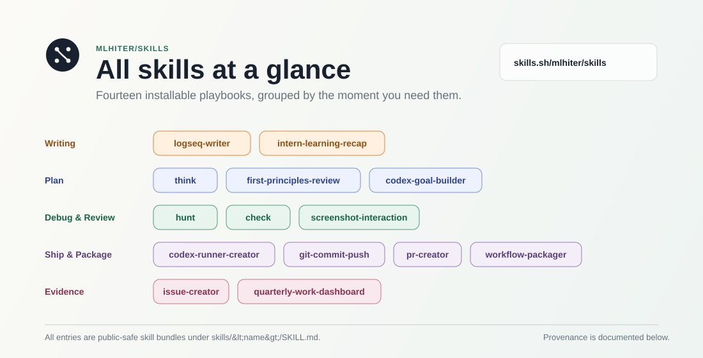

<!-- prettier-ignore -->
<div align="center">



# mlhiter skills

Reusable Codex agent skills and templates for planning, debugging, review, writing, workflow packaging, and safe project follow-through.

[](https://skills.sh/mlhiter/skills)

[Browse on skills.sh](https://skills.sh/mlhiter/skills) | [Install](#install) | [Asset catalog](#asset-catalog)

Languages: [en](README.md) | [zh](README.zh-CN.md)

</div>

`mlhiter/skills` is a public catalog of installable agent skills and reusable agent templates. Each skill is a portable instruction bundle under `skills/<skill-name>/SKILL.md`, with any references, scripts, or assets kept inside the owning skill directory.

Use this repository when you want Codex to follow a durable workflow instead of a one-off prompt: think through a feature, hunt down a regression, review before shipping, create a clean commit, package repeated work into a reusable skill, borrow a public-safe global `AGENTS.md` baseline, or turn rough notes into a useful artifact.

The recurring Codex tasks I use are also published here as sanitized [automation templates](templates/codex-automations/README.md). You can ask your agent to read one, adapt it to your local projects and timezone, and create it in your current Codex task.

## Install

Preview the catalog:

```bash
npx skills add mlhiter/skills --list
```

Install every skill:

```bash
npx skills add mlhiter/skills --all
```

Install one skill:

```bash
npx skills add mlhiter/skills --skill check
```

> [!TIP]
> Start with one skill if you only need a specific workflow. Each installed skill is self-contained enough to be read and audited before use.

## Prompting tips

These small prompts make skill-driven work more reliable:

1. Ask the agent to `restate my request` before it starts. A clear restatement exposes mismatched assumptions early.
2. Ask the agent to `use first principles` when designing a plan. It should identify the invariant, source of truth, ownership boundary, causal chain, and smallest mechanism that solves the problem.
3. Ask the agent to `use adversarial review` when reviewing code. It should actively look for malformed input, concurrency issues, tenant or auth boundary mistakes, unsafe sinks, cache surprises, deploy risks, and rollback gaps.

The second and third prompts are credited to Khazix.

## Asset catalog

| Area | Asset | Use it when |
| :--- | :--- | :--- |
| Writing | [`logseq-writer`](skills/logseq-writer/SKILL.md) | Turning topics, drafts, and notes into practical Logseq-style tutorial articles. |
| Writing | [`intern-learning-recap`](skills/intern-learning-recap/SKILL.md) | Explaining completed work as an intern-friendly technical learning recap. |
| Planning | [`think`](skills/think/SKILL.md) | Turning rough ideas into decision-complete plans before coding. |
| Debugging | [`hunt`](skills/hunt/SKILL.md) | Finding root cause before fixing errors, regressions, crashes, and broken behavior. |
| Review | [`check`](skills/check/SKILL.md) | Reviewing completed work with feature-intent modeling, functional acceptance, adversarial review, and release gates. |
| Codex | [`codex-goal-builder`](skills/codex-goal-builder/SKILL.md) | Drafting evidence-based Codex Goals from rough long-running objectives. |
| Codex | [`codex-runner-creator`](skills/codex-runner-creator/SKILL.md) | Creating or repairing Codex app environment run actions. |
| Codex | [`codex-dynamic-workflows`](skills/codex-dynamic-workflows/SKILL.md) | Planning and running supervised multi-agent workflows with explicit packets, approval gates, integration, and verification. |
| Codex | [`workflow-packager`](skills/workflow-packager/SKILL.md) | Mining repeated agent work and turning it into skills, subagents, automations, or templates. |
| Git | [`git-commit-push`](skills/git-commit-push/SKILL.md) | Creating session-scoped Conventional Commits and safely publishing them. |
| Git | [`pr-creator`](skills/pr-creator/SKILL.md) | Creating pull requests with explicit base/head resolution and fork/upstream safety. |
| Reporting | [`quarterly-work-dashboard`](skills/quarterly-work-dashboard/SKILL.md) | Generating leadership-facing quarterly dashboards from read-only GitHub and Feishu evidence. |
| QA | [`issue-creator`](skills/issue-creator/SKILL.md) | Turning terse tester notes into structured GitHub issues. |
| Design | [`design`](skills/design/SKILL.md) | Building distinctive UI with reference-app direction, brand preset decomposition, and rendered-surface verification. |
| Design | [`screenshot-interaction`](skills/screenshot-interaction/SKILL.md) | Inferring expected UI behavior, states, and interactions from screenshots. |
| Life Design | [`life-design-dschool`](skills/life-design-dschool/SKILL.md) | Guiding a warm Stanford-style life design interview toward Odyssey plans and a personal blueprint. |
| Template | [`global AGENTS.md`](templates/global/AGENTS.md) | Starting from a public-safe global agent instruction baseline while keeping it separate from this repository's project-level `AGENTS.md`. |
| Template | [`Codex automation templates`](templates/codex-automations/README.md) | Reusing the author's GitHub Trending, AI news, and weekly work review schedules through your own agent. |

## Repository layout

```text
.
|-- README.md
|-- README.zh-CN.md
|-- AGENTS.md
|-- assets/
|   `-- mlhiter-skills.svg
|-- skills.sh.json
|-- templates/
|   |-- codex-automations/
|   |   |-- README.md
|   |   `-- <automation-name>/automation.toml
|   `-- global/
|       `-- AGENTS.md
`-- skills/
    `-- <skill-name>/
        |-- SKILL.md
        |-- references/
        |-- scripts/
        `-- assets/
```

`README.md` and `README.zh-CN.md` are the discovery surfaces, `AGENTS.md` is project-level guidance for agents working in this repository, `skills.sh.json` is the publishable catalog metadata, and each `skills/<skill-name>/` directory owns the instructions and bundled materials for that skill. `templates/global/AGENTS.md` is a shareable global agents template, while `templates/codex-automations/` contains portable automation definitions that an agent can recreate in a user's Codex task.

## Provenance

Some assets are original playbooks from personal workflows. Some are adapted from public skill repositories and then extended for Codex, durable context, runtime evidence, and Chinese/English workflow usage.

| Asset | Provenance |
| :--- | :--- |
| `think` | Adapted from [`tw93/Waza`](https://github.com/tw93/Waza)'s `think` workflow, then extended for Codex planning and durable context. |
| `hunt` | Adapted from [`tw93/Waza`](https://github.com/tw93/Waza)'s `hunt` workflow, then extended with root-cause gates and runtime evidence ladders. |
| `check` | Adapted from [`tw93/Waza`](https://github.com/tw93/Waza)'s `check` workflow, then extended with feature-intent risk modeling, acceptance gates, and release checks. |
| `logseq-writer` | Original personal writing workflow for practical Logseq tutorial articles. |
| `workflow-packager` | Original workflow-mining playbook for turning repeated agent work into reusable assets. |
| `quarterly-work-dashboard` | Original dashboard-generation workflow for read-only GitHub and Feishu quarterly evidence. |
| `codex-goal-builder` | Original Codex Goal drafting workflow. |
| `codex-runner-creator` | Original Codex app environment-action workflow. |
| `codex-dynamic-workflows` | External skill from [`DannyMac180/skills`](https://github.com/DannyMac180/skills/tree/5695fa19b9d39b8270025e79633b49a8b863f9a2/codex-dynamic-workflows), MIT licensed. |
| `git-commit-push` | Original session-scoped git commit and safe-push workflow based on Conventional Commits. |
| `pr-creator` | Original PR-creation workflow focused on explicit fork/upstream head and base safety. |
| `intern-learning-recap` | Original intern-friendly teaching recap workflow. |
| `issue-creator` | Original QA issue drafting workflow for structured GitHub issue creation. |
| `design` | Original UI design workflow, extended with reference-app direction and [`VoltAgent/awesome-design-md`](https://github.com/VoltAgent/awesome-design-md) brand preset decomposition. |
| `screenshot-interaction` | Original screenshot-to-interaction-contract workflow. |
| `life-design-dschool` | Inspired by Khazix's life-design interview framing, then adapted with Stanford d.school life design, flow, and positive psychology methods. |
| `global AGENTS.md` | Original public-safe global agent instruction baseline for sharing reusable guidance outside a repository root. |
| `Codex automation templates` | Sanitized versions of the repository author's active recurring Codex tasks, published for agent-assisted reuse. |

External repositories such as [`mattpocock/skills`](https://github.com/mattpocock/skills) have also been reviewed as pattern sources, especially for public-interface discipline and tighter feedback loops. The assets in this catalog are not wholesale copies of that repository.

## Safety

These skills and templates are instruction bundles that can influence how an agent reads files, writes project changes, creates commits, or interacts with external tools. Read the relevant `SKILL.md` or template before installing, copying, or invoking a workflow, especially for assets that inspect local histories, change project files, or publish artifacts.
