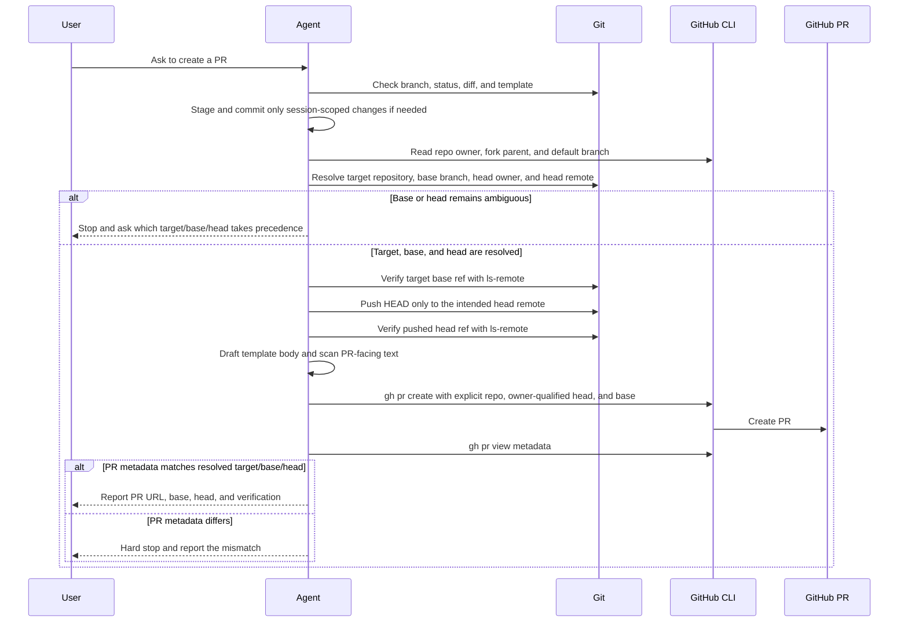
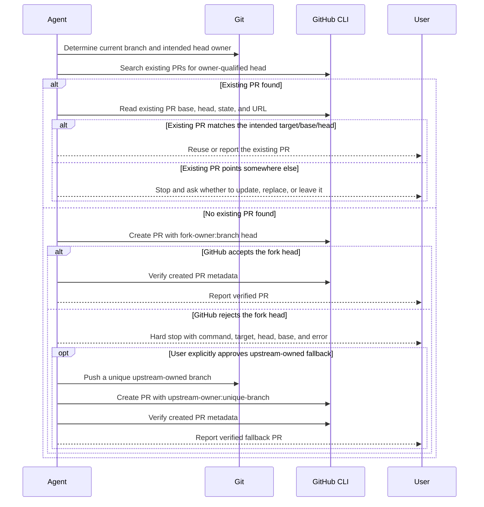

# Pull Request Creator

Create high-quality pull requests that follow the repository template and keep
the PR head/base unambiguous.

## PR Flow Diagrams

Use these sequence diagrams as the decision map for every PR. The numbered
workflow below remains the executable checklist.

### Standard PR Path



### Existing PR and Fork-Failure Path



## Workflow

1. **Branch Management**: Ensure you are not working on `main` or `master`.
   ```bash
   git branch --show-current
   ```
   If needed, create a descriptive branch before making or publishing commits:
   ```bash
   git checkout -b <new-branch-name>
   ```

2. **Commit Changes**: Verify all intended changes are committed.
   ```bash
   git status --porcelain
   git diff
   git diff --staged
   ```
   Stage only the files or hunks that belong to the current PR. Do not commit
   unrelated dirty work, secrets, credentials, or direct changes to `main`.

3. **Locate Template**: Search for a pull request template.
   - `.github/pull_request_template.md`
   - `.github/PULL_REQUEST_TEMPLATE.md`
   - `.github/PULL_REQUEST_TEMPLATE/*`

4. **Draft Description**: Fill the template faithfully.
   - Write the PR title and all PR-facing text in English by default, even when
     the conversation with the user is in another language.
   - This includes the title, body, template answers, checklist notes,
     verification notes, and any public PR comments or follow-up text.
   - Do not include Chinese/CJK text in the PR unless the user or repository
     explicitly requires a different public language.
   - Keep the template headings.
   - Mark checklist items only when they are actually complete.
   - Include concise summaries, test results, and related issues when relevant.

5. **Run Preflight**: Run the repository's established verification command
   before creating the PR. If there is no clear preflight command, inspect the
   project docs and use the smallest relevant build, lint, or test command.

6. **Resolve Target, Base, and Head**: Do this before pushing or calling
   `gh pr create`.
   ```bash
   branch="$(git branch --show-current)"
   git branch -vv
   git config --get-regexp "^branch\\.${branch}\\." || true
   git remote -v
   gh repo view --json nameWithOwner,isFork,parent,defaultBranchRef
   ```
   - Resolve the target repository where the PR should be opened.
   - Resolve the base branch from an explicit merge-base config when available
     (`branch.<branch>.gh-merge-base` or `branch.<branch>.vscode-merge-base`);
     otherwise compare likely bases and ask if it remains ambiguous.
   - Resolve the intended head owner, head repository, and head remote. In a
     fork-to-upstream workflow, the head is normally the fork owner and the
     target is the upstream owner.
   - Do not treat tracking config (`branch.<branch>.remote` or
     `branch.<branch>.merge`) as the PR base.
   - Before opening a new PR, check whether an existing PR already uses the
     resolved owner-qualified head:
     ```bash
     gh pr list \
       --repo <target-owner/repo> \
       --head <head-owner>:<branch> \
       --state all
     ```
     If an existing PR matches the intended target/base/head, reuse or report
     it. If it points at a different target, base, or head, stop and ask whether
     to update, replace, or leave it.

7. **Push Only to the Intended Head Remote**: Verify both refs, then push the
   current branch to the chosen head remote.
   ```bash
   git ls-remote --heads <target-remote> <base>
   git push <head-remote> HEAD:<branch>
   git ls-remote --heads <head-remote> <branch>
   ```
   Use `-u` only when binding local tracking to this same intended head is safe
   and explicit.

8. **Create PR with an Owner-Qualified Head**: Write the body to a temporary
   file, scan the title/body for unintended Chinese/CJK text, then create the
   PR with explicit `--repo`, `--head`, and `--base`.
   ```bash
   python3 - "$title" "$body_file" <<'PY'
   import pathlib
   import re
   import sys

   title = sys.argv[1]
   body = pathlib.Path(sys.argv[2]).read_text()
   if re.search(r"[\u3400-\u9fff\uf900-\ufaff]", title + "\n" + body):
       raise SystemExit("PR title/body contain Chinese/CJK text; rewrite them in English before creating the PR.")
   PY
   ```

   ```bash
   gh pr create \
     --repo <target-owner/repo> \
     --head <head-owner>:<branch> \
     --base <base> \
     --title "type(scope): succinct description" \
     --body-file <temp_file_path>
   ```

   **Hard stop for fork failures:** If `gh pr create --head <fork-owner>:<branch>`
   fails because GitHub does not accept that fork head, do not push `<branch>`
   to the upstream repository as a same-name fallback, and do not create a PR
   from `upstream:<branch>`. Stop and report the failed command, resolved
   target, resolved head, base branch, and error.

   Only after explicit user approval may you use an upstream-owned head as a
   fallback. When approved, prefer a unique upstream branch name, push to that
   exact branch, use an owner-qualified `--head <upstream-owner>:<branch>`, and
   verify the PR head after creation.

9. **Verify PR Head/Base**: After creation, confirm the PR points at the
   intended owner/ref before reporting success.
   ```bash
   gh pr view <number-or-url> \
     --repo <target-owner/repo> \
     --json url,headRepositoryOwner,headRefName,baseRefName,isCrossRepository,commits
   ```
   The reported `headRepositoryOwner`, `headRefName`, and `baseRefName` must
   match the resolved target. If they do not match, stop and report the mismatch.

## Principles

- Never push to `main` or `master`.
- Never silently switch the PR head owner or remote.
- Always use owner-qualified `--head <owner>:<branch>` for fork/upstream PRs.
- Never ignore the PR template.
- Keep PR titles, descriptions, checklist text, verification notes, and public
  PR comments in English by default.
- Do not mark checklist items that have not been verified.
